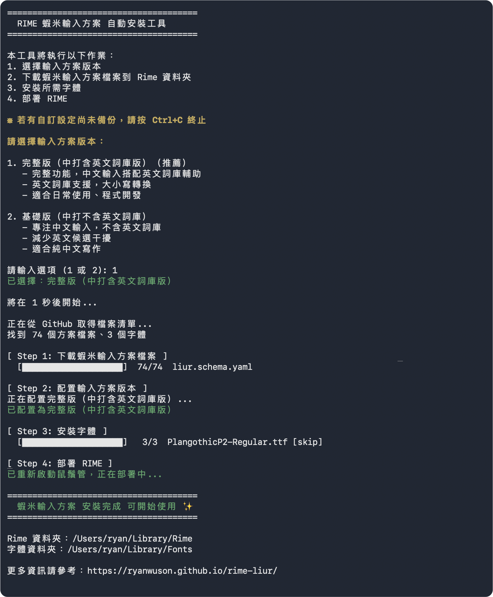
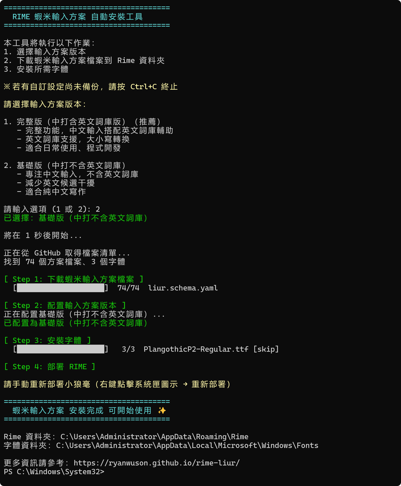

# 蝦米輸入法 Rime 方案

基於 Rime 輸入法引擎的蝦米輸入法方案，提供多元之輸入體驗，包含豐富的功能和仿 macOS 原生風格的候選字框主題。

## 主要特色

- 🚀 **蝦米功能**：包含標準字碼、簡碼及 VRSF 選擇等等完整功能
- 🎨 **精美主題**：仿 macOS 原生輸入法風格，支援淺色/深色主題自動切換
- 📝 **智慧造詞**：支援臨時造詞和自訂詞庫編輯
- 🔍 **多種查詢模式**：字碼查詢、讀音查詢、同音字查詢、萬用字元查詢
- 🎯 **快打模式**：提示可用簡碼，幫助學習和提升輸入效率
- 🔤 **豐富符號**：50+ 分類符號清單、變體英數、字母變化形
- 📅 **日期時間**：多格式日期時間輸出
- 🎵 **注音支援**：注音輸入、注音直出、讀音查詢
- 🔠 **拼音輸入**：漢語拼音輸入，支援數字聲調
- 🌐 **英文詞庫**：完整版包含英文詞庫，支援自動補全和大小寫轉換（`]`/`]]`）

## 版本選擇

本方案提供兩個版本供使用者選擇：

- **基礎版（中打不含英文詞庫）**：專注中文輸入，不含英文詞庫，減少英文候選干擾
- **完整版（中打含英文詞庫版）**：包含英文詞庫，支援英文自動補全和大小寫轉換

安裝腳本會自動提示選擇版本。

## 快速開始

### 安裝需求

- **macOS**: 鼠鬚管 ([Squirrel](https://github.com/rime/squirrel/releases))
- **Windows**: 小狼毫 ([Weasel](https://github.com/rime/weasel/releases))

### 手動安裝步驟

1. 下載本專案所有檔案
2. 將檔案複製到 Rime 使用者資料夾：
   - **macOS**: `~/Library/Rime/`
   - **Windows**: `%AppData%\Rime\`
3. 選擇版本：
   - **基礎版（中打不含英文詞庫）**：從 `configs` 資料夾複製 `liur.chinese-only.schema.yaml` 到 Rime 使用者資料夾，並重新命名為 `liur.schema.yaml`
   - **完整版（中打含英文詞庫版）**：從 `configs` 資料夾複製 `liur.schema.yaml` 到 Rime 使用者資料夾
4. 重新部署 Rime

### 指令安裝步驟

#### macOS

打開終端機 (Terminal)，輸入以下指令：
```bash
curl -fsSL https://raw.githubusercontent.com/ryanwuson/rime-liur/main/rime_liur_installer.sh | bash
```

腳本會自動下載所需檔案並安裝字體



#### Windows

打開 PowerShell，輸入以下指令：
```powershell
irm https://raw.githubusercontent.com/ryanwuson/rime-liur/main/rime_liur_installer.ps1 | iex
```

腳本會自動下載所需檔案並安裝字體



### 基本使用

- 直接輸入蝦米字碼，按 `Space` 或數字鍵選字
- 按 `Ctrl + '` 開啟查碼模式，學習字碼拆解
- 輸入 `,,sp` 開啟快打模式，輸入時顯示簡碼提示
- 輸入 `;` 進入造詞模式

## 主要功能

| 功能 | 快捷鍵/引導鍵 | 說明 |
|:-----|:-------------|:-----|
| 英文輸入 | `Ctrl + /` | 臨時英文輸入 |
| 造詞模式 | `;` | 臨時造詞功能 |
| 同音選字 | `'` | 選中候選字後按 `'`，顯示同音字 |
| 讀音查詢 | `;;` | 輸入字碼查讀音 |
| 注音輸入 | `';` | 注音輸入中文 |
| 拼音輸入 | `;'` | 漢語拼音輸入中文 |
| 符號清單 | `` ` `` | 50+ 分類符號 |
| 快打模式 | `,,sp` | 提示可用簡碼 |
| 萬用查字 | `,,wc` + `?` | 模糊查詢字碼 |
| 查碼模式 | `Ctrl + '` | 顯示字碼，學習拆字 |
| 按鍵說明 | `,,h` | 顯示所有快捷鍵說明 |

## 文件

- 📖 **[完整使用說明](https://ryanwuson.github.io/rime-liur/)** - 詳細功能介紹和使用方法
- 🎨 **主題設定** - 字體安裝和候選字框自訂
- ⚙️ **進階設定** - 自訂詞庫和個人化配置

## 系統需求

### 字體需求

為確保最佳顯示效果，請安裝以下字體：

**macOS**:

- MapleMonoNormal-Regular.ttf
- PlangothicP1-Regular.ttf  
- PlangothicP2-Regular.ttf

**Windows**:
- MapleMonoNormal-Regular.ttf
- SourceHanSansTC-Regular.otf
- PlangothicP1-Regular.ttf
- PlangothicP2-Regular.ttf

## 授權

本專案基於開源授權發佈，歡迎使用和改進。

## 致謝

自使用RIME輸入法以來，用過不少人提供的方案，也從中獲取相關靈感及檔案，進行後續的重整、規劃及建置，特此感謝。

-  [onion](https://github.com/oniondelta/Onion_Rime_Files)
-  [Ryan.Chou](https://github.com/hsuanyi-chou/rime-liur)
-  [hftsai256](https://github.com/hftsai256/rime-liur-lua)
-  [ianzhuo](https://github.com/ianzhuo/rime-liur)