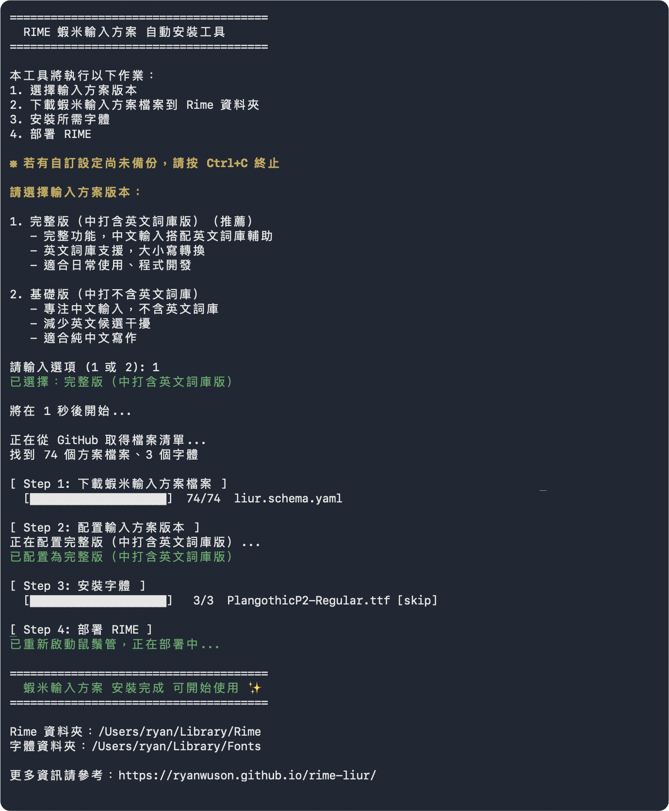
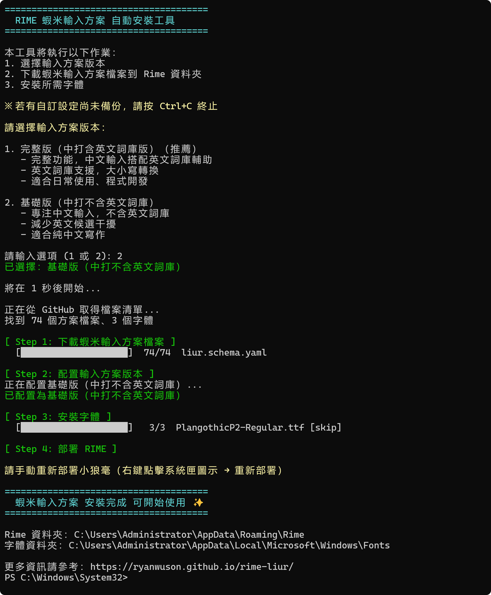

# 指令安裝（Mac / Windows）

指令安裝會自動下載方案檔案並安裝字體，是最省事的方式。

## macOS

打開「終端機」(Terminal)，貼上並執行：

```bash
curl -fsSL https://raw.githubusercontent.com/ryanwuson/rime-liur/main/rime_liur_installer.sh | bash
```



## Windows

打開 PowerShell，貼上並執行：

```powershell
irm https://raw.githubusercontent.com/ryanwuson/rime-liur/main/rime_liur_installer.ps1 | iex
```



## 安裝後

1. 依提示選擇版本（基礎版／完整版）。
2. 安裝完成後 **重新部署 Rime**：
   - macOS：<code>Ctrl + Option + &#96;</code>（重新部署）
   - Windows：右鍵點工作列輸入法圖示 → 「重新部署」
3. 首次安裝的字體若沒生效，重開一次應用程式即可。

## 相關

- [方案切換與快捷鍵](/getting-started/switch-schemes.md)
- [自訂設定](/getting-started/customize.md)
- [主題與字體設定](/appearance/theme-font.md)
