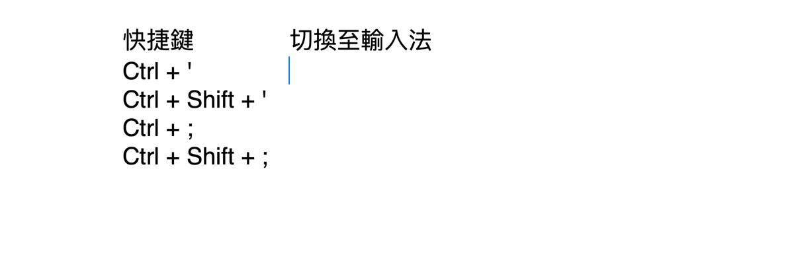

# 方案切換與快捷鍵

本方案內含四套輸入方案，可用快捷鍵直接互相跳轉：

| 方案 | 名稱 | 用途 |
|------|------|------|
| `liur` | 嘸蝦米 | 主力蝦米字碼輸入 |
| `liu_bpmf` | 注音輸入法 | 獨立注音方案 |
| `liu_pinyin` | 拼音輸入法 | 獨立拼音方案 |
| `easy_en` | Easy English | 英文連續輸入 |

## 切換快捷鍵

> 記法：`'` 族＝蝦米／注音；`;` 族＝英文／拼音；`/`＝查碼。

| 快捷鍵 | 跳到 |
|--------|------|
| `Ctrl + '` | 嘸蝦米（liur） |
| `Ctrl + Shift + '` | 注音輸入法（liu_bpmf） |
| `Ctrl + ;` | Easy English（英文） |
| `Ctrl + Shift + ;` | 拼音輸入法（liu_pinyin） |

這些是「絕對跳轉」：不論目前在哪一套方案，按下都會直接切到指定方案。

?> 若你之前用舊版：切換鍵已全面調整。舊版的 `Ctrl + /` 切英文、`Ctrl + '` 查碼，現在分別改為 `Ctrl + ;` 切英文、`Ctrl + /` 查碼；`Ctrl + '` 改為切回嘸蝦米。

## 常用開關

以下開關在嘸蝦米方案中有效：

| 快捷鍵 | 功能 | 狀態 |
|--------|------|------|
| `Shift` 或 `Caps Lock` | 中英切換 | 中文 ↔ 英文 |
| `Shift + Space` | 全半形切換 | 半形 ↔ 全形 |
| `Ctrl + /` | 查碼模式 | 正常 ↔ 查碼 |
| `Ctrl + .` | 繁簡切換 | 繁體 ↔ 简体 |
| `Ctrl + ,` | 擴充字集 | 常用 ↔ 擴充字集 |

## 用方案選單切換

也可以按 <code>Ctrl + &#96;</code>（Control + 反引號）叫出 Rime 方案選單，用方向鍵選「注音輸入法」「拼音輸入法」等再按 `Enter`。

## 相關

- [注音輸入法（獨立方案）](/features/bopomofo.md)
- [拼音輸入法（獨立方案）](/features/pinyin.md)
- [自訂設定](/getting-started/customize.md)
- [快捷鍵總表](/reference/shortcuts.md)
