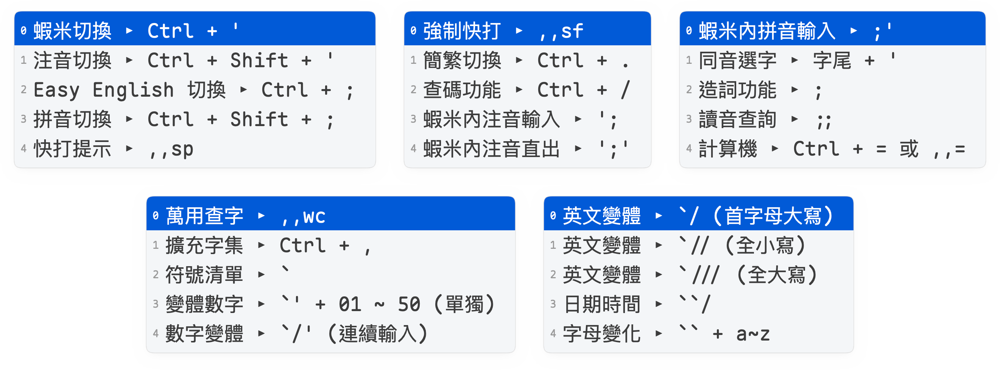

# 按鍵說明（,,h）

## 功能說明

- **引導鍵**：`,,h`
- **提示**：《按鍵說明》▸
- **說明**：顯示主要功能的快捷鍵與引導鍵，最後一項為完整說明網址，方便隨時查閱。

## 顯示內容

輸入 `,,h` 後，候選會依序列出：

```text
蝦米切換 ▸ Ctrl + '
注音切換 ▸ Ctrl + Shift + '
Easy English 切換 ▸ Ctrl + ;
拼音切換 ▸ Ctrl + Shift + ;
快打提示 ▸ ,,sp
強制快打 ▸ ,,sf
簡繁切換 ▸ Ctrl + .
查碼功能 ▸ Ctrl + /
蝦米內注音輸入 ▸ ';
蝦米內注音直出 ▸ ';'
蝦米內拼音輸入 ▸ ;'
同音選字 ▸ 字尾 + '
造詞功能 ▸ ;
讀音查詢 ▸ ;;
計算機 ▸ Ctrl + = 或 ,,=
萬用查字 ▸ ,,wc
擴充字集 ▸ Ctrl + ,
符號清單 ▸ `
變體數字 ▸ `' + 01 ~ 50 (單獨)
數字變體 ▸ `/' (連續輸入)
英文變體 ▸ `/ (首字母大寫)
英文變體 ▸ `// (全小寫)
英文變體 ▸ `/// (全大寫)
日期時間 ▸ ``/
字母變化 ▸ `` + a~z
完整說明 ▸ ryanwuson.github.io/rime-liur
```



## 相關

- [快捷鍵總表](/reference/shortcuts.md)
- [引導鍵總表](/reference/guide-keys.md)
